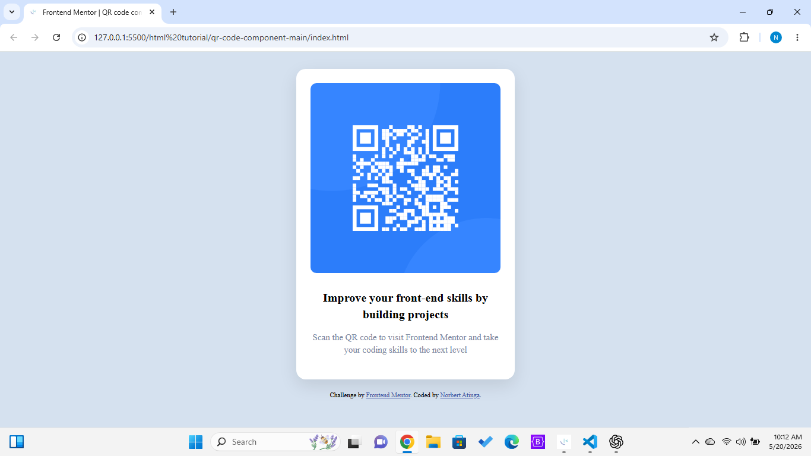

# Frontend Mentor - QR code component solution

This is my solution to the [QR code component challenge on Frontend Mentor](https://www.frontendmentor.io/challenges/qr-code-component-iux_sIO_H).  

---

## Overview

### Screenshot



---

### Links

- - Solution URL: https://github.com/atinganorbert9-beep/qr-code-component
- Live Site URL:  https://atinganorbert9-beep.github.io/qr-code-component/

---

## My process

### Built with

- Semantic HTML5
- CSS custom properties
- Flexbox
- Mobile-first workflow

---

### What I learned

This project helped me understand:

- How to structure a webpage using semantic HTML
- How Flexbox works for centering layouts
- How to build a responsive card component
- How spacing and typography improve UI design
- How to use box-shadow for modern UI styling
- How image paths work in HTML
- How Bootstrap utility classes simplify styling

Example CSS I used:

```css
.container {
  max-width: 320px;
  padding: 24px;
  border-radius: 16px;
  text-align: center;
  box-shadow: 0 10px 30px rgba(0, 0, 0, 0.1);
}
```

---

### Continued development

In future projects, I want to improve:

- My Flexbox and CSS Grid skills
- Writing cleaner and reusable CSS
- Responsive design techniques
- Building layouts faster without relying too much on tutorials
- Converting designs into pixel-perfect websites

---

### Useful resources

- https://www.frontendmentor.io - Real-world frontend challenges
- https://developer.mozilla.org - HTML and CSS documentation
- https://css-tricks.com - Helped me understand Flexbox and layout concepts

---

### AI Collaboration

I used ChatGPT during this project to:

- Understand Flexbox and layout behavior
- Debug CSS styling issues
- Learn proper HTML structure
- Improve spacing, typography, and responsiveness

What worked well:
- Step-by-step guidance helped me understand concepts instead of blindly copying code.

What I learned:
- Frontend development becomes easier when breaking the UI into small parts.

---

## Author

- Frontend Mentor - [@atinganorbert9-beep](https://www.frontendmentor.io/profile/atinganorbert9-beep)
- GitHub - https://github.com/atinganorbert9-beep


Example HTML structure I practiced:
```html
<div class="container">
  
  
  <h1>
    Improve your front-end skills by building projects
  </h1>

  <p>
    Scan the QR code to visit Frontend Mentor and take your coding skills to the next level
  </p>
</div>
```